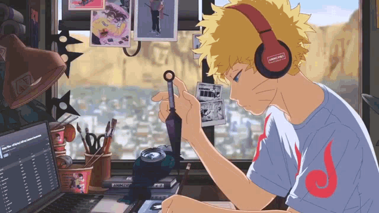

<!-- ########################################## ########################################## -->


## 👋 Hello! I am Vishal Meena 

A budding game developer diving into the world of game creation. Currently learning C++ to build my skills and create interactive experiences. I’m passionate about exploring game mechanics, crafting stories, and bringing creative ideas to life.
<tbody>

  <p align="left">  </p>
<table>
    <tbody border="0" cellspacing="0" cellpadding="0">
        <tr  style="width:70%">
           <td rowspan=6>
           
🌱 What I’m working on:   
* Building my first games and demos in C++
* Experimenting with game engines like Unity and Unreal Engine 
* Growing my knowledge in coding, physics, and design principles 

🎯 Goals:
*  Release my first complete game
* Collaborate with other developers to expand my skills
* Share and learn through open-source projects

Let’s connect and create something amazing together!
              
</table>
</tbody>


```dart
// Languages and Tools
class About extends Me {
  const myTools = {
    "ProgramingLanguages" : { "C++", "C", "C#", "Python" },
    "OtherLanguages" : { "HTML", "CSS" },
    "Editors" : { "Vscode", "ZED" },
    "Platforms" : { "MAC", "Windows" },
    "GameEngine" : { "Unity" },
  };
}
```


<p align = "center">
  
  
</p>
<!-- <hr></hr> -->
<div align="center" width="50">
<!--  -->
</div>
<p align="center">

</p>

## Links

<p align="center">
  <a href="mailto:vishal.609.vishal.609@gmail.com"></a>
   <a href="https://www.instagram.com/vishal__meena.609?igsh=MWIkdWc2N3FnMmpjbQ=="></a>
<a href="https://www.linkedin.com/in/vishal2186"></a>
  
</p>

#


<!-- ########################################## ########################################## -->
